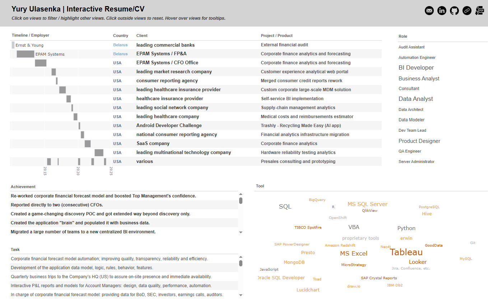

This is a Python (pandas, Dash) interactice CV/Resume.

Deployed here:
https://potato42.pythonanywhere.com

Custom crossfiltering and formatting mimics Tableau's "dashboard actions" behavior and formatting:
- when the Use clicks on a dashboard view (tablea, chart, etc.), other views get filtered or highlighted similar to Tableau
- when the Use clicks outside of a dashboard view, other views change back to their default state
